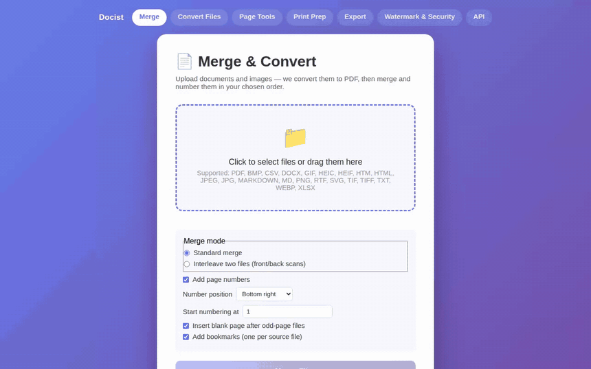
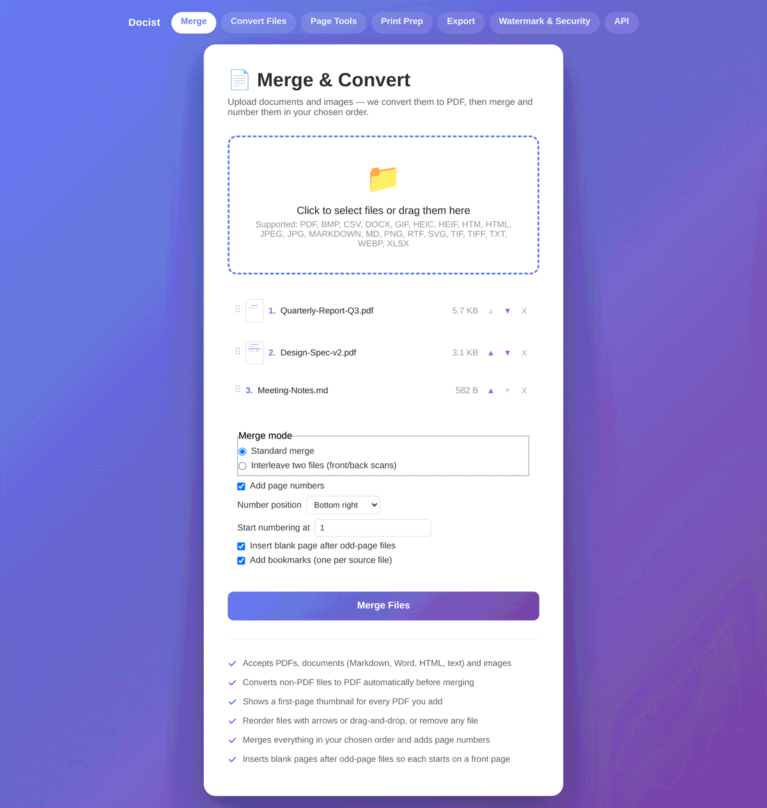
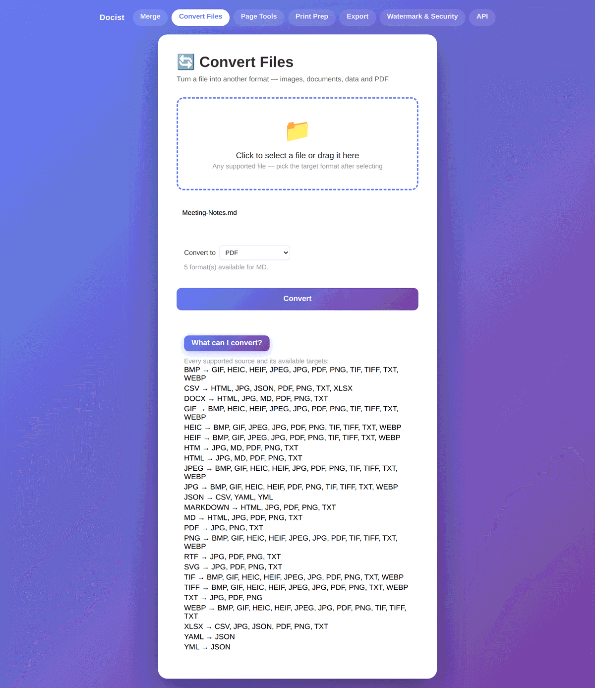
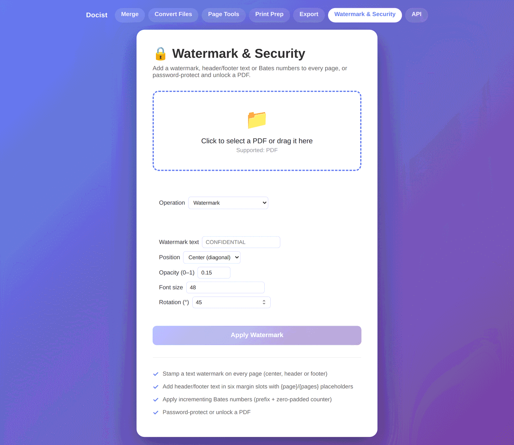
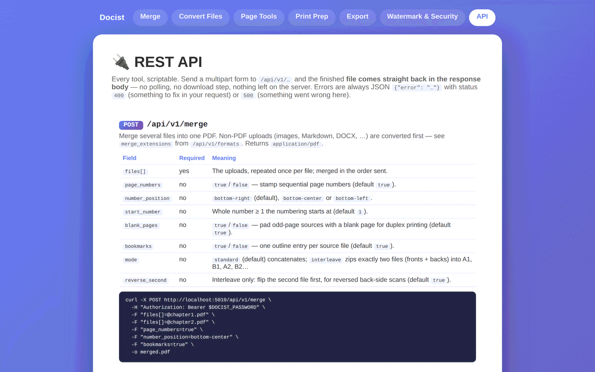

# Docist

A self-hosted document toolkit: merge PDFs (auto-converting ~19 input formats on the way in), convert files between ~150 format pairs, edit and split pages, impose booklets, export to images or text with OCR, and stamp, watermark and password-protect documents — six browser tools and a REST API, open to anonymous visitors within a daily limit, with email accounts for more.



## Highlights

- **Six tool pages plus a REST API** — Merge & Convert, Convert Files, Page Tools, Print Prep, Export, Watermark & Security, and a versioned `/api/v1` with docs served at `/api`.
- **Plugin architecture** — converters (`anything → PDF`) and transforms (`anything → anything`) are auto-discovered modules; no registry file to edit. When no direct transform exists, the registry pivots through PDF automatically, so `DOCX → PNG` works without anyone writing it.
- **Page thumbnails throughout** — every PDF added to the merge list shows its first page; Page Tools renders a clickable grid of the whole document that fills the page-range box for you.
- **767 tests** — 559 backend (pytest) and 208 frontend (`node:test`), covering every converter, transform, PDF operation, route and hardening rule.
- **Accounts and daily limits** — anonymous use with a per-IP daily allowance, email + password accounts with a larger one, per-user API keys, and results only their owner can download.
- **Hardened for deployment** — CSRF protection, per-IP rate limiting, magic-byte content sniffing on every upload, traversal-proof downloads, per-request temp directories, and AES-256 PDF encryption.

## Features

### Merge & Convert (`/`)



- **Multiple File Upload**: Select and upload multiple files at once
- **Page thumbnails**: Every PDF row shows a rendered first-page thumbnail, so you can tell two similarly-named scans apart before merging
- **Format Conversion**: Non-PDF files are automatically converted to PDF before merging:
  - Markdown (`.md`, `.markdown`) — headings, tables, code blocks, lists
  - Word documents (`.docx`)
  - HTML (`.html`, `.htm`)
  - Plain text (`.txt`) — monospace, line-wrapped, multi-page
  - Rich text (`.rtf`) — plain-text extraction
  - Spreadsheets (`.csv`, `.xlsx`) — rendered as tables, one per sheet, landscape for wide sheets
  - Images (`.png`, `.jpg`, `.jpeg`, `.gif`, `.bmp`, `.webp`, `.tiff`, `.tif`, `.heic`, `.heif`) — centered on the chosen paper, multi-frame TIFF/GIF becomes multiple pages
  - Vector graphics (`.svg`) — scaled to fit the page
- **Paper**: Letter (default) or A4 for every converted file; the browser remembers the choice. PDFs keep their own pages, and HTML that sets its own `@page` size keeps it
- **Reorder & Remove**: Drag rows (or use ▲/▼ buttons) to reorder files before merging; remove files with ✕
- **Merge Options**: Toggle page numbers (position: bottom left/center/right, custom start number), toggle blank-page insertion, toggle bookmarks, paper size
- **Bookmarks**: The merged PDF gets one outline entry per source file
- **Front Page Alignment**: Optionally insert blank pages after odd-page documents so every file starts on a front page (perfect for duplex printing; off by default)
- **Interleave Mode**: Combine two separately-scanned stacks (fronts + backs) by alternating pages, with reverse-order handling for flatbed/ADF back-side scans

### Convert Files (`/convert`)

Universal file-to-file conversion — upload a file, pick a target format. The page shows the full conversion matrix.



- **Images ↔ images**: PNG, JPG, WebP, BMP, TIFF, GIF, HEIC/HEIF — every direction (alpha flattened for JPEG/BMP, adaptive palette for GIF)
- **Documents**: Markdown ↔ HTML, HTML → Markdown/text, DOCX → HTML/Markdown/text, RTF → text, Markdown → text
- **Data**: CSV ↔ XLSX, CSV/XLSX → JSON, JSON → CSV, JSON ↔ YAML, CSV → HTML table
- **PDF bridge**: any supported format → PDF; PDF → PNG/JPG (zip when multi-page) or text
- **Image → text (OCR)**: any raster image → `.txt` via Tesseract, in one or two of the installed languages
- **Pivot routing**: when no direct path exists, conversions chain automatically through PDF (e.g. Markdown → PNG, SVG → JPG)

### Page Tools (`/pages`)


- **Page thumbnail grid** — the whole document is rendered as a grid; clicking a page appends its number to the range box for the current operation
- **Extract / Remove pages** by range spec (e.g. `1-3,5,8-10`)
- **Rotate pages** (90°/180°/270°, all pages or a range)
- **Split PDF** — every N pages, or by ranges (`;`-separated), delivered as a zip
- **Compress** — lossless content-stream compression plus image downsampling/re-encoding (quality and DPI caps); output never larger than input
- **OCR (make searchable)** — adds an invisible text layer to scanned PDFs via OCRmyPDF/Tesseract; choice of up to two installed languages (14 in the Docker image), optional deskew, force re-OCR; pages that already have text pass through untouched

### Print Prep (`/print`)
- **N-up** — 2 or 4 pages per sheet on Letter or A4, aspect-preserving, centered
- **Booklet** — saddle-stitch imposition: print duplex (flip on short edge), fold in half, read in order

### Export (`/export`)
- **PDF → images** — PNG or JPG per page at 30–600 DPI, zipped
- **PDF → text** — UTF-8 text with page separators, with optional OCR fallback for scanned pages (only pages without a text layer are OCR'd)

### Watermark & Security (`/security`)



- **Text watermark** — center (diagonal), header, or footer; opacity, font size, rotation, color
- **Header / Footer** — six slots (left/center/right × top/bottom) with `{page}` and `{pages}` placeholders
- **Bates numbering** — prefix + zero-padded counter (e.g. ACME000001), four corner positions
- **Protect** — password-encrypt a PDF with **AES-256** (`/V 5 /R 6`, via pypdf + `cryptography`)
- **Unlock** — remove password protection (requires the current password); accepts legacy RC4-40/RC4-128/AES-128 files created elsewhere as well as Docist's own AES-256 output

## REST API

Every tool is scriptable. Send a multipart form to `/api/v1/…` and the finished **file comes back in the response body** — no polling, no download step, and nothing is written to `output/`. Errors are always JSON `{"error": "…"}` with status `400` (fixable request) or `500`.

| Method | Endpoint | Returns |
|---|---|---|
| `POST` | `/api/v1/merge` | Merge many uploads (PDF or convertible) into one PDF |
| `POST` | `/api/v1/convert` | One file converted to `target` (e.g. `.png`); a multi-page `pdf → png` comes back as a `.zip` |
| `POST` | `/api/v1/pages/extract` | A new PDF containing only the `ranges` you named |
| `POST` | `/api/v1/pages/split` | The parts, bundled as one `application/zip` |
| `POST` | `/api/v1/watermark` | The PDF with `text` stamped across every page |
| `GET` | `/api/v1/formats` | Discovery JSON: merge inputs, convert sources, and the full conversion matrix |

```bash
curl -X POST http://localhost:5010/api/v1/merge \
  -H "Authorization: Bearer $DOCIST_API_KEY" \
  -F "files[]=@chapter1.pdf" \
  -F "files[]=@notes.md" \
  -F "page_numbers=true" \
  -F "number_position=bottom-center" \
  -o merged.pdf
```

Every `POST` needs a per-user API key as a bearer token. Sign up, verify your email, and create a key on `/account`; it is shown once and stored only as a hash. A missing key gives `401 {"error": "API key required. Create one at /account."}`, a wrong or revoked one `401 {"error": "Invalid or revoked API key."}`. The browser session cookie is ignored on `/api/v1`. Each successful call costs one operation from the key owner's daily allowance, reported in the `X-Docist-Usage-Limit` / `X-Docist-Usage-Remaining` headers; past it you get `429` with `code: "daily_limit"` and a `Retry-After`. `GET /api/v1/formats` needs no key, and the operator can open keyless calls with `DOCIST_API_ANONYMOUS=1` (off by default). **`/api` serves the full documentation** — every field, default and `curl` example for all six endpoints:



## Security & Deployment

Docist ships hardened for small self-hosted deployments (see `DEPLOYMENT.md` for the full recipe — gunicorn, nginx, systemd):

- **Anonymous use, daily limits** — every tool works without an account, up to `DOCIST_LIMIT_ANON` operations a day per IP (default 10). A verified free account gets `DOCIST_LIMIT_FREE` (default 50); any paid plan is unlimited by default. One operation is one successful tool POST or API call; the count resets at midnight UTC and the nav shows what is left.
- **Accounts** — email and password (scrypt hashes), email verification and password reset through a pluggable sender (`console`, SMTP or Resend), 30-day signed sessions (`HttpOnly`/`SameSite=Lax`, `Secure` behind HTTPS), "sign out everywhere", and throttled login/signup/reset forms. Unverified accounts stay on guest limits. Plans are set with `flask --app app set-plan EMAIL PLAN`; there is no billing yet.
- **CSRF protection** — every browser POST carries a per-session token; `/api/v1` ignores the cookie and needs a key instead.
- **Safe, owner-bound downloads** — the shared `/download` endpoint refuses path traversal, serves only plain filenames inside `output/`, and answers 404 unless the result was made by the same browser session or signed-in user.
- **Upload validation** — file content is sniffed (magic bytes) against the claimed extension before any converter runs.
- **Isolated, self-cleaning storage** — every request works in its own temp directory; results get unguessable names (an owner tag plus a random key only the requester receives) and are pruned from `output/` after 24h (configurable).
- **Rate limiting** — sliding-window per-IP limit on all POSTs, `/login` included.
- **Sane defaults** — dev server binds `127.0.0.1`, debug is off unless `FLASK_DEBUG=1`, request size capped at 50 MB.

## Plugin Architecture

Two registries, both populated by walking their package at import time. Adding a format means adding a file.

### Adding a converter (`anything → PDF`, used by the merge pipeline)

Drop a module into `converters/` that defines:

```python
EXTENSIONS = ['.ext']

def convert(input_path, output_path):
    ...  # write a PDF to output_path, raise converters.ConversionError on failure
```

Restart the app and the new format is accepted automatically (the UI reads `/formats`).

### Adding a transform (`anything → anything`, used by Convert Files and `/api/v1/convert`)

Drop a module into `transforms/` that defines:

```python
TRANSFORMS = {
    ('.png', '.jpg'): convert_png_to_jpg,   # lowercase extensions, with dot
}
```

Each function takes `(input_path, output_path)` and may return the path it actually wrote (e.g. a `.zip` when one input yields many files). The registry handles the rest, including **pivot routing**: if `(src, '.pdf')` and `('.pdf', dst)` both exist but `(src, dst)` does not, the two are composed through a temporary PDF, so pairs like `DOCX → PNG` work without a dedicated plugin.

## Setup

1. Make sure you're in the project directory:
   ```bash
   cd ~/projects/Docist
   ```

2. Activate the virtual environment:
   ```bash
   source .venv/bin/activate
   ```

3. Install dependencies:
   ```bash
   pip install -r requirements.txt
   ```

## Running the Application

```bash
./run.sh           # dev server on http://localhost:5010
./run.sh prod      # gunicorn (--preload, 2 workers) on 127.0.0.1:5010
```

Or manually: `source .venv/bin/activate && python app.py`

Accounts live in SQLite under `instance/` unless `DATABASE_URL` points at Postgres. Emails are logged to the terminal until a sender is configured. See `DEPLOYMENT.md` for the production settings (`DOCIST_SECRET_KEY`, `DOCIST_COOKIE_SECURE`, `DOCIST_TRUSTED_PROXIES`, the email backends).

## File Structure

```
Docist/
├── app.py                      # Flask bootstrap: env config, database, auto-
│                               #   registered blueprints, request hook chain
├── models.py                   # Users, API keys, daily usage, email tokens
├── routes/                    # Flask blueprints (auto-discovered)
│   ├── auth.py                # Signup, login, logout, verify, forgot/reset
│   ├── account.py             # Account page: password, API keys, sign-out-all
│   ├── merge.py               # Merge & convert endpoints + shared /download
│   ├── convert.py             # Universal file-to-file conversion
│   ├── pages.py               # Page tools endpoints
│   ├── print.py               # Print prep endpoints
│   ├── export.py              # Export endpoints
│   ├── security.py            # Watermark & security endpoints
│   ├── preview.py             # Page-thumbnail endpoint (base64, nothing stored)
│   └── api.py                 # Versioned REST API (/api/v1) + docs page (/api)
├── pdf_ops/                   # Pure PDF operations (no Flask)
│   ├── merge.py               # Configurable merge pipeline + bookmarks + interleave
│   ├── pages.py               # Split / extract / remove / rotate
│   ├── optimize.py            # Compression
│   ├── imposition.py          # N-up / booklet
│   ├── export.py              # PDF → images / text
│   ├── ocr.py                 # OCR (make searchable)
│   ├── watermark.py           # Text watermarking
│   ├── stamp.py               # Header/footer, Bates numbering
│   ├── preview.py             # Page thumbnail rendering (pypdfium2)
│   └── security.py            # Protect (AES-256) / unlock
├── converters/                # Format-to-PDF converter plugins (auto-discovered)
├── transforms/                # File-to-file transform plugins (auto-discovered,
│                              #   with automatic pivot-through-PDF routing)
├── utils/                     # Web-layer helpers: identity, CSRF, metering,
│                              #   mailer, owner-bound result names, upload
│                              #   sniffing, output pruning, rate limiter
├── templates/                 # Web interface (one page per tool area, the
│                              #   auth and account pages, shared partials)
│   └── api.html               # Rendered REST API reference served at /api
├── static/                    # Shared theme CSS + per-page JS
│   └── favicon.svg            # App icon
├── tests/                     # Backend (pytest) and frontend (node:test) suites
├── docs/                      # README demo GIF and screenshots
├── instance/                  # SQLite database + persisted secret key (gitignored)
├── output/                    # Processed results (auto-pruned)
├── DEPLOYMENT.md              # Production setup: env vars, accounts, email,
│                              #   Railway, nginx, systemd
├── requirements.txt           # Runtime dependencies
└── requirements-dev.txt       # + pytest
```

## Testing

```bash
.venv/bin/python -m pytest tests        # 559 backend tests (+ page-serving tests)
node --test tests/frontend/*.test.js    # 208 frontend pure-logic tests
```

## Requirements

### System prerequisites (optional, for OCR features)

OCR features (Make Searchable, image → text, OCR fallback in Export) require
system binaries; without them the app runs normally and OCR options appear
disabled with an explanatory hint:

```bash
# Fedora
sudo dnf install tesseract ghostscript
# Debian/Ubuntu
sudo apt install tesseract-ocr ghostscript
```

Additional OCR languages are Tesseract data packages (e.g. `tesseract-langpack-deu` on Fedora, `tesseract-ocr-deu` on Debian). The Docker image installs 14: English, Spanish, French, German, Portuguese, Italian, Chinese (Simplified and Traditional), Vietnamese, Arabic, Russian, Korean, Japanese and Filipino. One request may name at most `DOCIST_OCR_MAX_LANGS` languages (default 2).

### Python

- Python 3.8+
- Flask, pypdf, cryptography, reportlab, werkzeug, gunicorn
- Markdown, xhtml2pdf (Markdown/HTML/DOCX rendering)
- Pillow, pillow-heif, svglib (image/vector conversion)
- mammoth (DOCX → HTML), openpyxl (XLSX), striprtf (RTF)
- pypdfium2 (PDF page rendering for export and thumbnails)
- html2text (HTML → Markdown/text), PyYAML (JSON ↔ YAML)
- ocrmypdf, pytesseract (OCR)

## Notes

- Maximum upload size: 50 MB per request, 90 MB for paid accounts (`DOCIST_MAX_UPLOAD_MB`, `DOCIST_MAX_UPLOAD_MB_PAID`)
- Accepted formats are listed by the `/formats` endpoint and shown in the UI
- Uploads are processed in per-request temporary directories and never persisted; results live in `output/` until pruned
- Conversion fidelity notes: DOCX styling is simplified for free and anonymous use (semantic structure is kept, Word theme fonts/colors are not); paid accounts get LibreOffice, which keeps the document's layout, page size, headers and footers but drops remote images; HTML rendering ignores external resources and JavaScript; plain text supports Latin-1 glyphs (others render as `?`)
